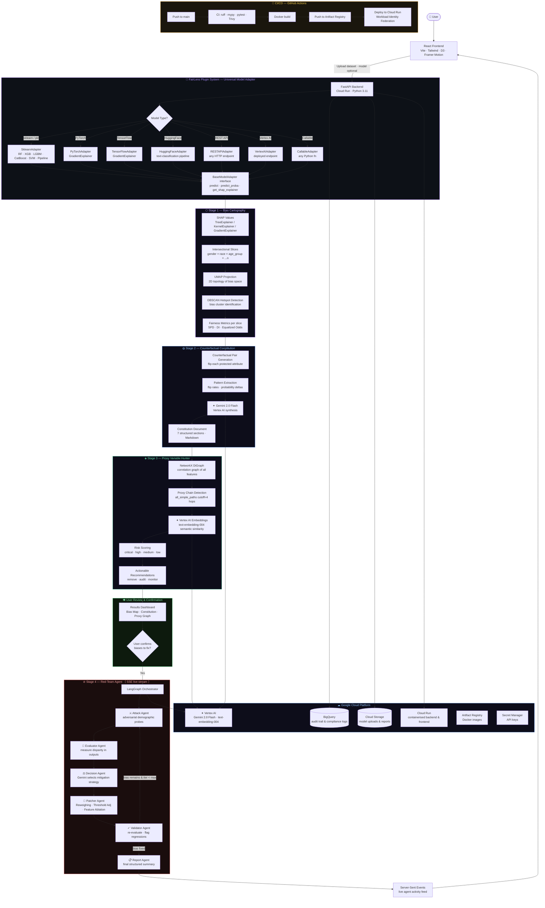

# FairLens — AI Bias Detection & Remediation Platform

> *"Computer programs now make life-changing decisions about who gets a job, a loan, or medical care. FairLens makes sure those decisions are fair."*

[](https://github.com/pallavikailas/fairlens/actions/workflows/ci.yml)
[](https://github.com/pallavikailas/fairlens/actions/workflows/deploy.yml)
[](https://developers.google.com/community/gdsc-solution-challenge)
[](https://sdgs.un.org/goals/goal10)
[](https://sdgs.un.org/goals/goal16)

---

## What is FairLens?

FairLens is a **model-agnostic** AI bias detection and remediation platform. It works as a **plugin for any model** — scikit-learn, PyTorch, TensorFlow, HuggingFace, a REST API, or a Vertex AI endpoint — and runs it through a four-stage pipeline that identifies, maps, explains, and fixes hidden bias.

**A model file is optional for stages 1–3.** Upload only a CSV dataset and FairLens will auto-detect protected attributes, run Bias Cartography, generate a dataset-level Constitution, and trace proxy chains without any model. A model is required only for Stage 4 (Red-Team adversarial probing).

### The Four Stages

| # | Stage | What it does |
|---|-------|-------------|
| ⬡ | **Bias Cartography** | Maps bias as a 2D topology across intersectional identity slices. Works with dataset only — no model required. Protected attributes and target column are **auto-detected by Gemini**. |
| ◍ | **Counterfactual Constitution** | Uses Gemini 2.0 Flash to generate a structured document showing what the model would have decided if only demographics changed. When no model is provided, generates a dataset-only statistical analysis. |
| ◈ | **Proxy Variable Hunter** | Traces indirect proxy chains (zip code → race, job title → gender) using NetworkX knowledge graphs + Vertex AI embeddings. Requires only a dataset. |
| ⊘ | **Red-Team Agent** | A LangGraph adversarial agent that attacks confirmed biases and applies mitigation patches — activated only after user confirmation. **Requires a model file.** |

---

## Plugin Architecture — Works With Any Model

FairLens is designed as a **universal bias audit plugin**. Any model can be audited without modifying the model itself:

```python
from app.services.model_adapter import FairLensAdapter

# scikit-learn / XGBoost / LightGBM / CatBoost
adapter = FairLensAdapter.from_sklearn(my_random_forest)

# PyTorch nn.Module
adapter = FairLensAdapter.from_pytorch(my_net, input_size=20)

# TensorFlow / Keras
adapter = FairLensAdapter.from_tensorflow(my_keras_model)

# HuggingFace pipeline or model name
adapter = FairLensAdapter.from_huggingface("distilbert-base-uncased-finetuned-sst-2-english")

# Any REST API (model behind an endpoint)
adapter = FairLensAdapter.from_api("https://my-model-api.com", auth_token="...")

# Vertex AI deployed endpoint
adapter = FairLensAdapter.from_vertex_ai("endpoint-id", project="my-gcp-project")

# Any Python callable
adapter = FairLensAdapter.from_callable(my_predict_fn, my_predict_proba_fn)

# Auto-detect from .pkl
adapter = FairLensAdapter.from_pickle("model.pkl")
```

All adapters expose the same interface: `predict(X)`, `predict_proba(X)`, `get_shap_explainer(X_background)`.

---

## Architecture Flowchart



---

## Tech Stack

| Layer | Technology |
|-------|-----------|
| Frontend | React 18, Vite, TypeScript, Tailwind CSS, D3.js, Framer Motion |
| State | Zustand |
| Backend | FastAPI, Python 3.11, Uvicorn |
| Plugin System | `FairLensAdapter` — wraps any model type |
| ML / XAI | SHAP, UMAP, DBSCAN, NetworkX, scikit-learn |
| AI Agents | LangGraph, LangChain |
| Google AI | **Gemini 2.0 Flash** (Constitution + Red-Team), **Vertex AI text-embedding-004** (Proxy Hunter) |
| GCP Services | Cloud Run, Vertex AI, BigQuery, Cloud Storage, Artifact Registry, Secret Manager |
| CI/CD | GitHub Actions → Artifact Registry → Cloud Run (Workload Identity Federation) |
| IaC | Terraform |
| Containers | Docker (multi-stage builds), Nginx |

---

## Quickstart (Local)

```bash
# 1. Clone
git clone https://github.com/pallavikailas/fairlens.git
cd fairlens

# 2. Backend
cd backend
pip install -r requirements.txt
cp .env.example .env          # Fill in GOOGLE_CLOUD_PROJECT etc.
uvicorn app.main:app --reload --port 8000

# 3. Frontend (new terminal)
cd frontend
npm install
npm run dev
# → http://localhost:5173
```

---

## GCP Deployment (one command after setup)

```bash
# Push to main — GitHub Actions handles the rest:
git push origin main

# Or deploy manually:
cd backend
gcloud run deploy fairlens-api --source . --region us-central1 --allow-unauthenticated \
  --memory 2Gi --cpu 2 --set-env-vars GOOGLE_CLOUD_PROJECT=YOUR_PROJECT_ID
```

See [`docs/GCP_SETUP.md`](docs/GCP_SETUP.md) for full Terraform + Workload Identity setup.

---

## Project Structure

```
fairlens/
├── .github/workflows/
│   ├── ci.yml                      # Lint · test · security scan
│   └── deploy.yml                  # Build → Artifact Registry → Cloud Run
├── backend/
│   ├── app/
│   │   ├── api/                    # FastAPI route handlers (one per stage)
│   │   ├── core/                   # Config, logging
│   │   └── services/
│   │       ├── model_adapter.py    # ← Universal plugin adapter (all model types)
│   │       ├── cartography.py      # Stage 1: SHAP + UMAP bias topology
│   │       ├── constitution.py     # Stage 2: Gemini counterfactual document
│   │       ├── proxy_hunter.py     # Stage 3: NetworkX + Vertex AI proxy chains
│   │       ├── redteam.py          # Stage 4: LangGraph adversarial agent
│   │       └── gcp_client.py       # BigQuery + Cloud Storage singletons
│   ├── tests/
│   │   ├── test_cartography.py
│   │   └── test_model_adapter.py   # Tests all adapter types
│   ├── Dockerfile
│   └── requirements.txt
├── frontend/
│   └── src/
│       ├── pages/
│       │   ├── LandingPage.tsx     # Hero · real-world examples · pipeline overview
│       │   ├── AuditPage.tsx       # Model type selector + upload + column config
│       │   ├── ResultsPage.tsx     # D3 bias map · constitution viewer · proxy graph · confirm UI
│       │   └── RedTeamPage.tsx     # Live SSE agent feed · before/after metrics · export
│       ├── hooks/useAuditStore.ts  # Zustand global state across all 4 stages
│       └── utils/api.ts            # Typed fetch wrappers + SSE consumer
├── infrastructure/
│   └── terraform/main.tf           # Provisions all GCP resources
└── docs/
    ├── architecture.mermaid
    └── GCP_SETUP.md
```

---

## Adding a Custom Model (Plugin Guide)

To audit a model type not listed above, implement `BaseModelAdapter`:

```python
from app.services.model_adapter import BaseModelAdapter
import pandas as pd
import numpy as np
import shap

class MyCustomAdapter(BaseModelAdapter):
    def __init__(self, my_model):
        self.model = my_model

    def predict(self, X: pd.DataFrame) -> np.ndarray:
        return self.model.infer(X.values)

    def predict_proba(self, X: pd.DataFrame) -> np.ndarray:
        scores = self.model.score(X.values)          # shape (n,)
        return np.column_stack([1 - scores, scores])

    def get_model_type(self) -> str:
        return "MyCustomModel"

# Use it:
adapter = MyCustomAdapter(my_model)
# Pass adapter to any FairLens service:
results = await cartography_service.run_cartography(model=adapter, X=X, ...)
```

That's it. The adapter pattern means FairLens never needs to know what your model is internally.

---

## Google Solution Challenge 2026

| Field | Value |
|-------|-------|
| Challenge | [Unbiased AI Decision] Ensuring Fairness and Detecting Bias in Automated Decisions |
| UN SDG Alignment | SDG 10 (Reduced Inequalities), SDG 16 (Justice & Strong Institutions) |
| Google AI Used | Gemini 2.0 Flash via Vertex AI |
| GCP Services | Cloud Run · Vertex AI · BigQuery · Cloud Storage · Artifact Registry · Secret Manager |
| Deployed | `gcloud run deploy` via GitHub Actions on every push to `main` |

---

*Built with ❤️ for Google Solution Challenge 2026*
