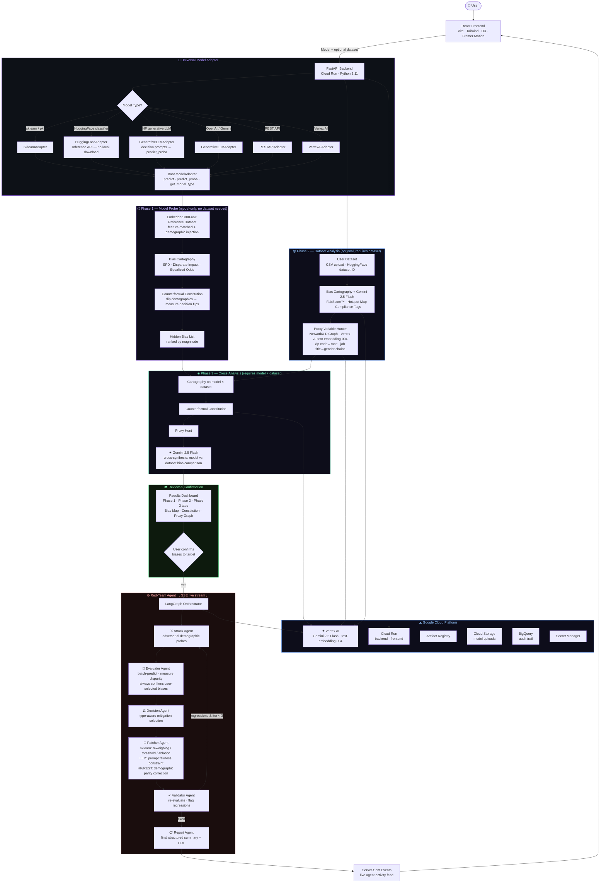

# FairLens — AI Bias Detection & Remediation Platform

> *"Computer programs now make life-changing decisions about who gets a job, a loan, or medical care. FairLens makes sure those decisions are fair."*

[](https://fairlens-frontend-nrk2z2yadq-uc.a.run.app)
[](https://fairlens-api-nrk2z2yadq-uc.a.run.app)
[](https://fairlens-api-nrk2z2yadq-uc.a.run.app/docs)

[](https://github.com/pallavikailas/fairlens/actions/workflows/ci.yml)
[](https://github.com/pallavikailas/fairlens/actions/workflows/deploy.yml)
[](https://hack2skill.com/event/build-with-ai?tab=solutionchallenge2026&utm_source=hack2skill&utm_medium=homepage)

---

## What is FairLens?

FairLens is a **model-agnostic** AI bias detection and remediation platform. Upload a model (and optionally a dataset) — FairLens runs a three-phase pipeline that identifies, maps, explains, and fixes hidden bias.

It works as a **plugin for any model** — scikit-learn, HuggingFace classifiers, generative LLMs (OpenAI, Gemini), a REST API, or a Vertex AI endpoint — with zero code changes to your model.

---

## The Three-Phase Pipeline

| Phase | Name | What it does |
|-------|------|-------------|
| **Configure** | Upload | Model (required) + dataset (optional). 6 model types supported. Column auto-detection handles the rest. |
| **Phase 1** | **Model Probe** | Probes the model on an embedded 300-row synthetic reference dataset to reveal hidden bias intrinsic to the model — no user dataset required. Runs Bias Cartography + Counterfactual Constitution on the probe data. |
| **Phase 2** | **Dataset Analysis** | *(Requires dataset)* Maps bias patterns in your dataset using Bias Cartography (SPD, Disparate Impact, Equalized Odds + Gemini 2.5 Flash) and Proxy Variable Hunt (zip code → race, job title → gender chains via NetworkX + Vertex AI embeddings). |
| **Phase 3** | **Cross-Analysis** | *(Requires model + dataset)* Runs Cartography, Counterfactual Constitution, and Proxy Hunt on the actual model × user dataset combination to measure real-world deployment bias. |
| **Review** | **Results** | Interactive results dashboard with FairScore™, regulatory compliance tags (EEOC, EU AI Act, ECOA, Fair Housing Act), bias topology map, and proxy chain graph. All three phases shown separately; confirmed biases pooled at the bottom. User selects biases to target. |
| **Red-Team** | **Remediation** | LangGraph adversarial agent: generates demographic probes, confirms user-selected biases, applies type-aware mitigation patches (reweighing / threshold adjustment / demographic parity correction / prompt constraints), validates fixes — streamed live via SSE. |

---

## Supported Model Types

| Type | How to use |
|------|-----------|
| **scikit-learn / XGBoost / LightGBM** | Upload a `.pkl` file |
| **HuggingFace** | Enter a model ID (e.g. `unitary/toxic-bert` or `google/gemma-3-1b-it`) — classifier vs. generative is **auto-detected** from the HF Hub |
| **OpenAI** | Enter model name + API key |
| **Gemini LLM** | Enter model name + API key |
| **REST API** | Any HTTP endpoint that accepts JSON and returns predictions |
| **Vertex AI** | Deployed endpoint ID + GCP project |

HuggingFace models use the **Inference API** — no local weights download, safe for serverless deployments.

---

## Testing with Known-Biased Datasets & Models

### HuggingFace Datasets

| Dataset ID | Why it's biased |
|---|---|
| `mstz/adult` | UCI Adult income — strong gender & race bias in income prediction |
| `iamollas/folktables` | US Census ACS — measurable racial income/employment disparities |
| `LabHC/bias_in_bios` | Profession prediction from biographies — heavy gender bias (doctors → male, nurses → female) |

### HuggingFace Models

| Model ID | Known bias |
|---|---|
| `unitary/toxic-bert` | Toxicity detection — flags African-American dialect at higher false-positive rates |
| `cardiffnlp/twitter-roberta-base-sentiment` | Sentiment analysis — racially disparate predictions on semantically identical text |
| `valurank/distilroberta-base-offensive-language-identification` | Offensive language — documented racial bias in false-positive rate |

### Best end-to-end test

**Dataset:** `LabHC/bias_in_bios` · **Model:** HuggingFace → `unitary/toxic-bert`

This exercises the full pipeline: the dataset has a `text` column (required for HuggingFace inference) and a `gender` protected attribute for bias measurement.

---

## Architecture



---

## Tech Stack

| Layer | Technology |
|-------|-----------|
| Frontend | React 18, Vite, TypeScript, Tailwind CSS, D3.js, Framer Motion, Zustand |
| Backend | FastAPI, Python 3.11, Uvicorn |
| Plugin System | `FairLensAdapter` — wraps sklearn, HuggingFace, OpenAI, Gemini, REST, Vertex AI |
| Bias Analysis | SPD, Disparate Impact, Equalized Odds · NetworkX proxy graphs · Bootstrap CIs |
| AI Agents | LangGraph multi-agent orchestration |
| Google AI | **Gemini 2.5 Flash** (Cartography + Constitution + Red-Team) · **Vertex AI text-embedding-004** (Proxy Hunter) |
| GCP Services | Cloud Run · Vertex AI · Artifact Registry · Cloud Storage · BigQuery · Secret Manager |
| CI/CD | GitHub Actions → Artifact Registry → Cloud Run (Workload Identity Federation) |
| IaC | Terraform |

---

## Quickstart (Local)

```bash
# 1. Clone
git clone https://github.com/pallavikailas/fairlens.git
cd fairlens

# 2. Backend
cd backend
pip install -r requirements.txt
cp .env.example .env          # fill in GOOGLE_CLOUD_PROJECT etc.
uvicorn app.main:app --reload --port 8000

# 3. Frontend (new terminal)
cd frontend
npm install
npm run dev
# → http://localhost:5173
```

---

## GCP Deployment

```bash
# Push to main — GitHub Actions handles the rest automatically.

# Or deploy manually:
gcloud run deploy fairlens-api \
  --source ./backend \
  --region us-central1 \
  --allow-unauthenticated \
  --memory 2Gi \
  --cpu 2 \
  --timeout 600 \
  --set-env-vars GOOGLE_CLOUD_PROJECT=YOUR_PROJECT_ID
```

See [`docs/GCP_SETUP.md`](docs/GCP_SETUP.md) for full Terraform + Workload Identity setup.

---

## Project Structure

```
fairlens/
├── .github/workflows/
│   ├── ci.yml                      # Lint · test · build check
│   └── deploy.yml                  # Docker → Artifact Registry → Cloud Run
├── backend/
│   ├── app/
│   │   ├── api/                    # FastAPI route handlers (one per phase)
│   │   │   ├── model_probe.py      # Phase 1: model probe endpoint
│   │   │   ├── dataset_probe.py    # Phase 2: dataset-only analysis endpoint
│   │   │   ├── cross_analysis.py   # Phase 3: model × dataset cross-analysis endpoint
│   │   │   ├── redteam.py          # Red-Team: SSE-streamed LangGraph agent
│   │   │   ├── reports.py          # PDF report generation endpoint
│   │   │   └── _utils.py           # Shared helpers
│   │   ├── core/config.py          # GCP project, Vertex AI, fairness thresholds
│   │   └── services/
│   │       ├── model_adapter.py    # Universal plugin adapter (all model types)
│   │       ├── model_probe.py      # Phase 1: probes model on embedded reference dataset
│   │       ├── reference_dataset.py# Embedded 300-row reference dataset + model-specific probe
│   │       ├── cartography.py      # Bias Cartography: SPD · DI · EO + Gemini synthesis
│   │       ├── constitution.py     # Counterfactual Constitution + Gemini synthesis
│   │       ├── proxy_hunter.py     # Proxy Variable Hunt: NetworkX + Vertex AI embeddings
│   │       ├── redteam.py          # LangGraph adversarial red-team agent
│   │       ├── report_generator.py # ReportLab PDF generator (all 3 phases)
│   │       ├── dataset_loader.py   # CSV upload + HuggingFace dataset streaming
│   │       ├── auto_detect.py      # Gemini-powered column detection
│   │       └── gemini_client.py    # Vertex AI / Gemini client
│   ├── Dockerfile
│   └── requirements.txt
├── frontend/
│   └── src/
│       ├── pages/
│       │   ├── LandingPage.tsx
│       │   ├── AuditPage.tsx       # Configure + runs all 3 phases with sub-stage tracking
│       │   ├── ResultsPage.tsx     # Phase 1/2/3 tabs + pooled bias confirmation
│       │   └── RedTeamPage.tsx     # Live SSE red-team agent feed
│       ├── components/
│       │   └── Layout.tsx          # Nav with phase progress + sub-stage indicator strip
│       ├── hooks/useAuditStore.ts  # Zustand global state (3-phase results + activeSubStage)
│       └── utils/api.ts            # Typed fetch wrappers + SSE consumer
├── infrastructure/
│   └── terraform/main.tf           # Cloud Run · Artifact Registry · BigQuery · GCS · IAM
└── docs/
    ├── architecture.mermaid
    └── GCP_SETUP.md
```

---

## Google Solution Challenge 2026

| Field | Value |
|-------|-------|
| Challenge | Ensuring Fairness and Detecting Bias in Automated Decisions |
| UN SDG Alignment | SDG 10 (Reduced Inequalities) · SDG 16 (Justice & Strong Institutions) |
| Google AI Used | Gemini 2.5 Flash · Vertex AI text-embedding-004 |
| GCP Services | Cloud Run · Vertex AI · Artifact Registry · Cloud Storage · BigQuery · Secret Manager |
| Deployment | GitHub Actions → Cloud Run on every push to `main` |

---

*Built for Google Solution Challenge 2026*
