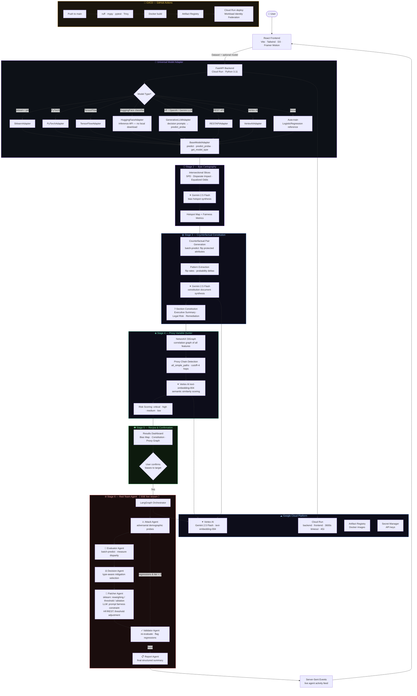

# FairLens — AI Bias Detection & Remediation Platform

> *"Computer programs now make life-changing decisions about who gets a job, a loan, or medical care. FairLens makes sure those decisions are fair."*

[](https://github.com/pallavikailas/fairlens/actions/workflows/ci.yml)
[](https://github.com/pallavikailas/fairlens/actions/workflows/deploy.yml)
<<<<<<< HEAD
[](https://hack2skill.com/event/build-with-ai?tab=solutionchallenge2026&utm_source=hack2skill&utm_medium=homepage)
=======
[]([https://hack2skill.com/event/build-with-ai?tab=solutionchallenge2026&utm_source=hack2skill&utm_medium=homepage])
>>>>>>> ae00f80f78079f5d573a5893f7db654160bac15e
[](https://sdgs.un.org/goals/goal10)
[](https://sdgs.un.org/goals/goal16)

---

## Live Deployment

[](https://fairlens-frontend-nrk2z2yadq-uc.a.run.app)
[](https://fairlens-api-nrk2z2yadq-uc.a.run.app)
[](https://fairlens-api-nrk2z2yadq-uc.a.run.app/docs)

---

## What is FairLens?

FairLens is a **model-agnostic** AI bias detection and remediation platform. It works as a **plugin for any model** — scikit-learn, PyTorch, TensorFlow, HuggingFace classifiers, generative LLMs (ChatGPT, Gemini, Llama), a REST API, or a Vertex AI endpoint — and runs it through a six-stage pipeline that identifies, maps, explains, and fixes hidden bias.

**A model is optional.** Upload only a CSV dataset and FairLens will auto-detect protected attributes, run Bias Cartography, auto-train a Logistic Regression reference model for counterfactual simulation, and trace proxy chains — no manual configuration needed.

---

## The Six Stages

| # | Stage | What it does |
|---|-------|-------------|
| 1 | **Upload** | Dataset (CSV or HuggingFace dataset ID) + optional model. Supports 7 model types. Auto-detection handles everything else. |
| 2 | **Bias Cartography** | Maps bias across intersectional identity slices using statistical metrics + Gemini 2.5 Flash. Works without a model. |
| 3 | **Counterfactual Constitution** | Generates a structured document showing what the model decides when only demographics change. Auto-trains a Logistic Regression reference when no model is provided. |
| 4 | **Proxy Variable Hunter** | Traces indirect proxy chains (zip code → race, job title → gender) using a correlation graph + Vertex AI embeddings. Dataset-only. |
| 5 | **Review** | Interactive results dashboard. User confirms which biases to target before the agent runs. |
| 6 | **Red-Team Agent** | LangGraph adversarial agent: generates demographic probes, measures disparity, applies type-aware mitigation patches, validates fixes — streamed live via SSE. Works with all model types. |

---

## Plugin Architecture — Works With Any Model

FairLens wraps any model through a single adapter interface. **HuggingFace models use the Inference API — no local weights download, safe for serverless deployments.**

```python
from app.services.model_adapter import FairLensAdapter

# scikit-learn / XGBoost / LightGBM / CatBoost
adapter = FairLensAdapter.from_sklearn(my_random_forest)

# PyTorch nn.Module
adapter = FairLensAdapter.from_pytorch(my_net, input_size=20)

# TensorFlow / Keras
adapter = FairLensAdapter.from_tensorflow(my_keras_model)

# HuggingFace text-classification (uses HF Inference API — no local download)
adapter = FairLensAdapter.from_huggingface("unitary/toxic-bert")

# HuggingFace generative LLM (Gemma, Llama, Mistral — via Inference API)
adapter = FairLensAdapter.from_generative_huggingface("google/gemma-2-2b-it", hf_token="...")

# OpenAI / ChatGPT
adapter = FairLensAdapter.from_openai(model_name="gpt-4o", api_key="...")

# Google Gemini
adapter = FairLensAdapter.from_gemini(model_name="gemini-2.0-flash", api_key="...")

# Any REST API endpoint
adapter = FairLensAdapter.from_api("https://my-model-api.com", auth_token="...")

# Vertex AI deployed endpoint
adapter = FairLensAdapter.from_vertex_ai("endpoint-id", project="my-gcp-project")

# Any Python callable
adapter = FairLensAdapter.from_callable(my_predict_fn, my_predict_proba_fn)

# Auto-detect from a .pkl file
adapter = FairLensAdapter.from_pickle("model.pkl")
```

All adapters expose the same interface: `predict(X)`, `predict_proba(X)`, `get_model_type()`.

---

## Testing with Biased Datasets & Models

Use these known-biased sources to verify FairLens is detecting bias correctly.

### Biased HuggingFace Datasets

Enter the dataset ID in the **HuggingFace Dataset** field:

| Dataset ID | Why it's biased |
|---|---|
| `mstz/adult` | UCI Adult income — strong gender & race bias in income prediction (classic benchmark) |
| `iamollas/folktables` | US Census ACS — measurable racial income/employment disparities |
| `LabHC/bias_in_bios` | Profession prediction from biographies — heavy gender bias (doctors → male, nurses → female). Has a `text` column, works directly with HuggingFace classifiers. |

### Biased HuggingFace Models

Select **HuggingFace Classifier** and enter the model ID:

| Model ID | Known bias |
|---|---|
| `unitary/toxic-bert` | Toxicity detection — flags African-American dialect at higher false-positive rates |
| `cardiffnlp/twitter-roberta-base-sentiment` | Sentiment analysis — racially disparate predictions on semantically identical text |
| `valurank/distilroberta-base-offensive-language-identification` | Offensive language — documented racial bias in false-positive rate |

### Best end-to-end test

**Dataset:** `LabHC/bias_in_bios` · **Model:** HuggingFace Classifier → `unitary/toxic-bert`

This exercises the full pipeline including counterfactual simulation: the dataset has a `text` column (required for HuggingFace inference) and a `gender` protected attribute for bias measurement.

### Auto-reference model (dataset-only)

Upload only a CSV with no model. FairLens auto-trains a **Logistic Regression reference model** on your data — the counterfactual constitution then reveals what bias any naive model would inherit from the training data, before a real model is ever deployed.

---

## Architecture



---

## Tech Stack

| Layer | Technology |
|-------|-----------|
| Frontend | React 18, Vite, TypeScript, Tailwind CSS, D3.js, Framer Motion, Zustand |
| Backend | FastAPI, Python 3.11, Uvicorn |
| Plugin System | `FairLensAdapter` — wraps sklearn, PyTorch, TF, HuggingFace, OpenAI, Gemini, REST, Vertex AI |
| Bias Analysis | Statistical fairness metrics (SPD, DI, Equalized Odds), NetworkX correlation graphs |
| AI Agents | LangGraph multi-agent orchestration |
| Google AI | **Gemini 2.5 Flash** (Cartography + Constitution + Red-Team decision), **Vertex AI text-embedding-004** (Proxy Hunter) |
| GCP Services | Cloud Run, Vertex AI, Artifact Registry, Secret Manager |
| CI/CD | GitHub Actions → Artifact Registry → Cloud Run (Workload Identity Federation) |
| IaC | Terraform |

---

## Quickstart (Local)

```bash
# 1. Clone
git clone https://github.com/pallavikailas/fairlens.git
cd fairlens

# 2. Backend
cd backend
pip install -r requirements.txt
cp .env.example .env          # fill in GOOGLE_CLOUD_PROJECT etc.
uvicorn app.main:app --reload --port 8000

# 3. Frontend (new terminal)
cd frontend
npm install
npm run dev
# → http://localhost:5173
```

---

## GCP Deployment

```bash
# Push to main — GitHub Actions handles the rest automatically.

# Or deploy manually:
gcloud run deploy fairlens-api \
  --source ./backend \
  --region us-central1 \
  --allow-unauthenticated \
  --memory 4Gi \
  --cpu 2 \
  --timeout 3600 \
  --set-env-vars GOOGLE_CLOUD_PROJECT=YOUR_PROJECT_ID
```

See [`docs/GCP_SETUP.md`](docs/GCP_SETUP.md) for full Terraform + Workload Identity setup.

---

## Project Structure

```
fairlens/
├── .github/workflows/
│   ├── ci.yml                      # Lint · test · security scan
│   └── deploy.yml                  # Build → Artifact Registry → Cloud Run
├── backend/
│   ├── app/
│   │   ├── api/                    # FastAPI route handlers (one per stage)
│   │   ├── core/                   # Config, logging
│   │   └── services/
│   │       ├── model_adapter.py    # Universal plugin adapter (all model types)
│   │       ├── cartography.py      # Stage 2: statistical bias mapping + Gemini
│   │       ├── constitution.py     # Stage 3: counterfactual simulation + Gemini
│   │       ├── proxy_hunter.py     # Stage 4: NetworkX proxy chains + Vertex AI
│   │       ├── redteam.py          # Stage 6: LangGraph adversarial agent
│   │       ├── dataset_loader.py   # CSV upload + HuggingFace dataset streaming
│   │       ├── auto_detect.py      # Gemini-powered column detection
│   │       └── gemini_client.py    # Vertex AI / Gemini client
│   ├── Dockerfile
│   └── requirements.txt
├── frontend/
│   └── src/
│       ├── pages/
│       │   ├── LandingPage.tsx     # Hero · pipeline overview · real-world examples
│       │   ├── AuditPage.tsx       # Model type selector · upload · dataset config
│       │   ├── ResultsPage.tsx     # D3 bias map · constitution · proxy graph · confirm UI
│       │   └── RedTeamPage.tsx     # Live SSE agent feed · mitigation results
│       ├── hooks/useAuditStore.ts  # Zustand global state (persists across all 6 stages)
│       └── utils/api.ts            # Typed fetch wrappers + SSE consumer
├── infrastructure/
│   └── terraform/main.tf           # Provisions all GCP resources
└── docs/
    ├── architecture.mermaid
    └── GCP_SETUP.md
```

---

## Adding a Custom Model

Implement `BaseModelAdapter` to audit any model type not listed above:

```python
from app.services.model_adapter import BaseModelAdapter
import pandas as pd, numpy as np

class MyCustomAdapter(BaseModelAdapter):
    def __init__(self, my_model):
        self.model = my_model

    def predict(self, X: pd.DataFrame) -> np.ndarray:
        return self.model.infer(X.values)

    def predict_proba(self, X: pd.DataFrame) -> np.ndarray:
        scores = self.model.score(X.values)
        return np.column_stack([1 - scores, scores])

    def get_model_type(self) -> str:
        return "MyCustomModel"
```

Pass the adapter to any FairLens service — no other changes needed.

---

## Google Solution Challenge 2026

| Field | Value |
|-------|-------|
| Challenge | Ensuring Fairness and Detecting Bias in Automated Decisions |
| UN SDG Alignment | SDG 10 (Reduced Inequalities), SDG 16 (Justice & Strong Institutions) |
| Google AI Used | Gemini 2.5 Flash · Vertex AI text-embedding-004 |
| GCP Services | Cloud Run · Vertex AI · Artifact Registry · Secret Manager |
| Deployment | GitHub Actions → Cloud Run on every push to `main` |

---

*Built for Google Solution Challenge 2026*
